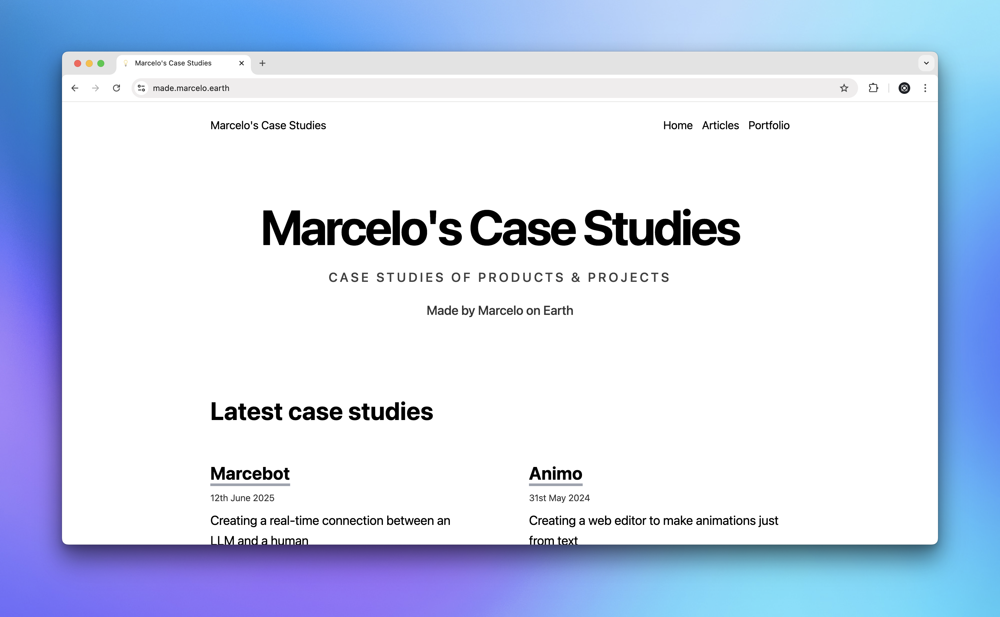

  <h1 align="center">Made by Marcelo on Earth</h1>

  Case studies about my experiences as a software creator.

## 🛠 Core Development

### 📦 Web Framework

Eleventy is a simple static site generator that uses vanilla JavaScript for templating. It is a great tool for building static websites and web applications.

### 🎨 Template

This website uses the 11ty template [Supermaya](https://github.com/madebymike/supermaya).

## 📃 License

Distributed under the MIT License.
See [`LICENSE`](./LICENSE) for more information.
